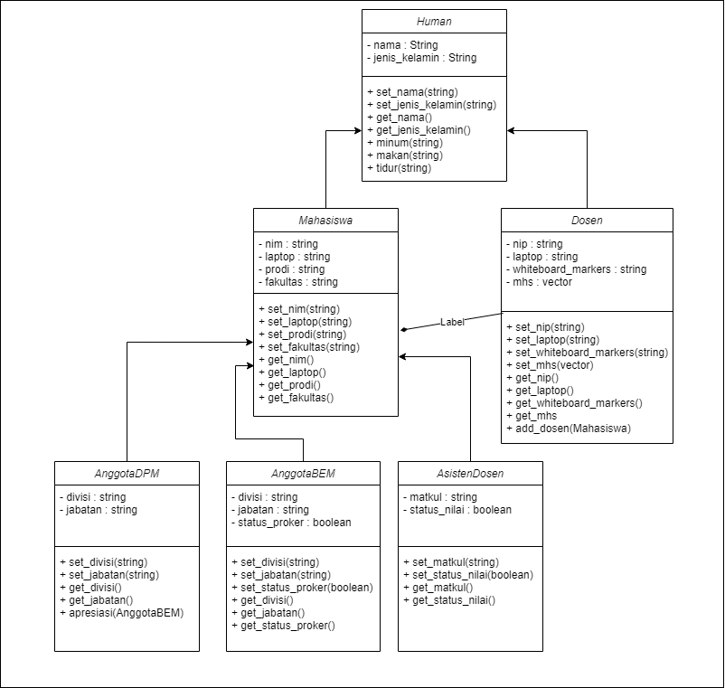

# TP1C1DPBO2023

# Janji
Saya Muhammad Cahyana Bintang Fajar NIM 2102665 mengerjakan TP1 dalam mata kuliah Desain dan Pemrograman Berorientasi Objek untuk keberkahanNya maka saya tidak melakukan kecurangan seperti yang telah dispesifikasikan. Aamiin.

## Desain Program 
Terdiri dari 6 class yaitu **Human**, **Dosen**, **Mahasiswa**, **AnggotaBEM**, **AnggotaDPM**, dan **AsistenDosen**

#### Diagram

Didalam class **Human** memiliki 2 Atribut, yaitu : 
* Nama
* Jenis Kelamin 

Didalam class **Mahasiswa** memiliki 4 Atribut, yaitu : 
* NIM
* Laptop
* Prodi
* Fakultas 

Didalam class **Dosen** memiliki 4 Atribut, yaitu : 
* NIP
* Laptop
* whiteboard_markers
* mhs

Didalam class **AnggotaBEM** memiliki 3 Atribut, yaitu : 
* divisi
* jabatan
* status_proker

Didalam class **AnggotaDPM** memiliki 2 Atribut, yaitu : 
* divisi
* jabatan

Didalam class **AsistenDosen** memiliki 2 Atribut, yaitu : 
* matkul
* status_nilai

## Alur Program
### Relasi Antar kelas
* disini saya membuat class human lalu mahasiswa dan dosen mengextend dari class human
* untuk class yg lain seperti anggotadpm,anggotabem dan asisten dosen dari mahasiswa karena ke3 itu pasti mahasiswa jadi saya mengextend dari sana
* lalu untuk interaksinya menggunakan boolean set status jika true berarti bisa diberikan jika false berarti tidak bisa diberikan
* saya juga me

### Cara Menjalankan Program
* untuk menjalankan program python cukup run saja main nya, dan untuk menjalankan cpp, anda harus menjalankannya seperti menjalankan 3 file di Alpro, yaitu menyatukannya dalam satu direktori folder, setelah itu buka terminalnya, dan jalankan perintah **g++ *.cpp -o run&&run**

### Dokumentasi 

